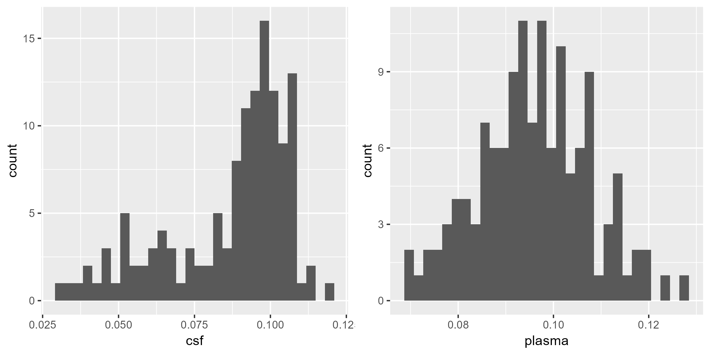
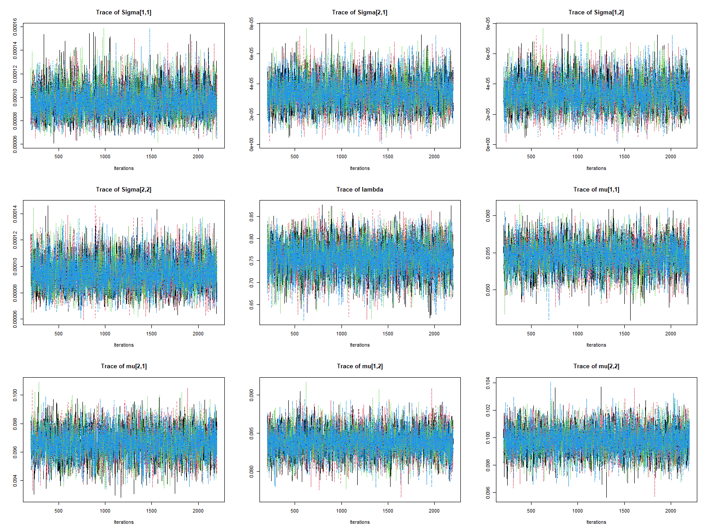

<!-- Title here: -->

# **Plasma** $A\beta_{42/40}$ biomarker for Alzheimer’s disease

<!-- Name here: -->

Shuai Zhu, MS[^1]; Nichole Carlson, PhD; Alexander M. Kaizer, PhD

[^1]: Department of Biostatistics and Informatics, Colorado School of Public Health, University of Colorado Anschutz Medical Campus, Aurora, CO

```{r, include=FALSE}
knitr::opts_chunk$set(echo = F,warning = F, message = F) 
```

```{r}
library(knitr)
library(table1)
library(kableExtra)
```

# INTRODUCTION

## Dementia and Alzheimer's Disease

Dementia is a decline in cognitive abilities severe enough to interfere with daily life. Individuals with dementia may experience memory loss, difficulty with problem-solving, and changes in behavior, mood, and personality. In 2019, an estimated 55 million people were living with dementia, and this number is projected to rise to 139 million by 2050 worldwide [@worldof2020]. According to the World Health Organization (WHO), Alzheimer’s disease (AD) is the most common cause of dementia, accounting for 60%–70% of cases [@dementia]. Alzheimer’s disease (AD) is a neurodegenerative disorder that leads to progressive cognitive decline.

## Amyloid Biomarkers

Numerous studies have identified a strong inverse correlation between cerebrospinal fluid (CSF) amyloid-beta ($A\beta$) levels and brain amyloid deposition. Brain amyloid deposition can be measured using $A\beta$ PET tracers, such as Pittsburgh Compound B (PIB). A positive PIB scan is associated with the lowest CSF $A\beta$ levels, whereas a negative PIB scan corresponds to the highest CSF $A\beta$ levels ($r = -0.63$). [@fagan2006] The CSF $A\beta_{42/40}$ biomarker has been shown to provide better diagnostic performance compared to CSF $A\beta_{42}$ alone. [@lewczuk] While CSF biomarkers effectively identify $A\beta$ deposition, which is the earliest pathological signature of AD, spinal tap procedures for CSF extraction are invasive and may cause discomfort. Thus, there is a growing interest in developing a cost-effective, plasma-based $A\beta$ biomarker test for AD diagnosis.

# MATERIALS AND METHODS

Participants in this study were recruited from the Longitudinal Innate Immunity and Aging (LIIA) cohort. The inclusion criteria were older adults aged 60 years or older, in good general health, and without a diagnosed memory disorder. The average cerebrospinal fluid (CSF) $A\beta_{42/40}$ ratio was 0.0865 (SD = 0.0205), while the average plasma $A\beta_{42/40}$ ratio was 0.096 (SD = 0.0118).

## Mixture model of CSF and Plasma $A\beta_{42/40}$ ratio

A mixture model is a probabilistic model that assumes that the data are generated from a mixture of several different underlying distributions. [@diebolt1994] Assuming observations $y_1, y_2,...,y_n$ come from a mixed population $f(y_i|\theta) = \sum_{j=1}^J p_jf_j(y_i|\theta)$ where $0<p_j<1$ satify $\sum_{j=1}^J p_j = 1$. The purpose of deploy mixture model in this study is to identify the component distributions and estimate the parameters for each of them. Figure 1 shows that distribution of CSF $A\beta_{42/40}$ and plasma $A\beta_{42/40}$ ratio from LIIA data. The CSF $A\beta_{42/40}$ ratio was from two different Gaussian distributions while The plasma $A\beta_{42/40}$ ratio was from one Gaussian distribution. Specifically, $y^{CSF}_1,y^{CSF}_2,...y^{CSF}_n$ comes from distribution $f_j(y_i|\theta)\sim N(\mu_j, \sigma_j)$ with probability $p_j$ for each $j=1,...J$. We want to estimate the parameters $\mu_j, \sigma_j$ for each cluster $j$, and the proportions between clusters $\{p_1,...p_J \}$. We also need a classification variable $Z=(z_1,...z_n)$ where $z_i=j$ indicate that $y_i$ is label to group $j$. $Z$ variable are a latent variable and consider as unknown parameter. [@franzèn]

## Bivariate Gaussian mixture model of CSF and Plasma $A\beta_{42/40}$ ratio

We are not able to use the information from plasma if we only fit CSF $A\beta_{42/40}$ ratio to Gaussian mixture model. So we fit the joint distribution of CSF and plasma $A\beta_{42/40}$ ratio to a bivariate Gaussian mixture model even the CSF $A\beta_{42/40}$ ratio may dominate the classification. Now, the joint of CSF and plasma $A\beta_{42/40}$ ratio are from distribution $f_j(y_i|\theta)\sim N(\mu_j, \Sigma_j)$ with probability $p_j$ for each $j=1,...J$ where $y_i=(y_i^{CSF}, y_i^{Plasma}), \mu_j=(\mu_j^{CSF},\mu_j^{Plasma})$ and $\Sigma_j$ is the variance covariance matrix of CSF and plasma $A\beta_{42/40}$ ratio.

## Youden Index to find optimal cut-point

Receiver operating characteristics(ROC) curve was often used in biomedical research to evaluate the performance of biomarker to distinguish subjects with disease or without. ROC curve is a plot of sensitivity(c) versus 1-specificity(c) over all possible threshold (c). The Youden J index which is a function of sensitivity and specificity is also freqently used in practice to find a global optimal cut-point. The J index is defined as J = $\text{max}_c \{\text{sensitivity}(c)+\text{specificity}(c)-1\}$. [@schisterman2005] [@youden1950] [@fluss2005] The J index can range from 0 to 1, with value closing to 1 indicating cut-point performance better and value closing to 0 indicating cut-point performance worse.

```{r}
t1kable(readRDS('../DataProcessed/table1.RDS'))%>%kable_styling(font_size = 11)
```

```{r, fig.cap='Distribution of CSF and Plasma Abeta ratio. Left: CSF Abeta 42/40 ratio. Right: Plasma Abeta 42/40 ratio.'}

```

## Gibbs sampler on mixture model

### Prior distribution
We use the conjugate priors for parameters $\mu_j, \Sigma_j, p_j, z_i$ of two component bivariate mixture model of CSF and plasma ratio. [@franzèn] [@lavine1992] The conjugate prior distribution of $\Sigma_j$ is inverse Wishart distribution with unknown $m \times m$ scale maxtirx $R_j$ and unknown degree of freedom $k_j\ge m$. The conjugate prior distribution of $\mu_j$ is the multivariate normal distribution with know variance covariance matrix $\Sigma_j/\tau_j$ and unknown mean vector $\xi_j$. 


That is 
$$
\Sigma_j \sim W^{-1}\left(k_j, R_j\right) 
$$
$$
\mu_j \mid {\Sigma}_j \sim N_j\left({\xi}_j, {\Sigma}_j / \tau_j\right)
$$

# RESULTS

# LIMITATION

bias introduced by machine. we don't have true label of real data. how was csf and plasma abeta measured.

\newpage
\onecolumn

# References

::: {#refs}
:::

\newpage

# Appendix

```{r}
readRDS('../DataProcessed/real data train test partitation.RDS')%>%kable()
```

```{r, fig.cap='Trace plot of real data with 130 subject'}

```
