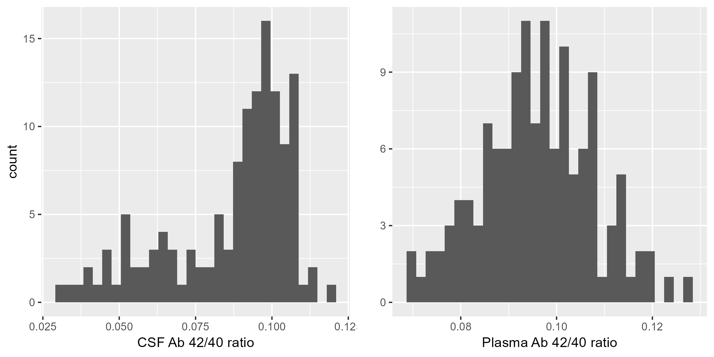
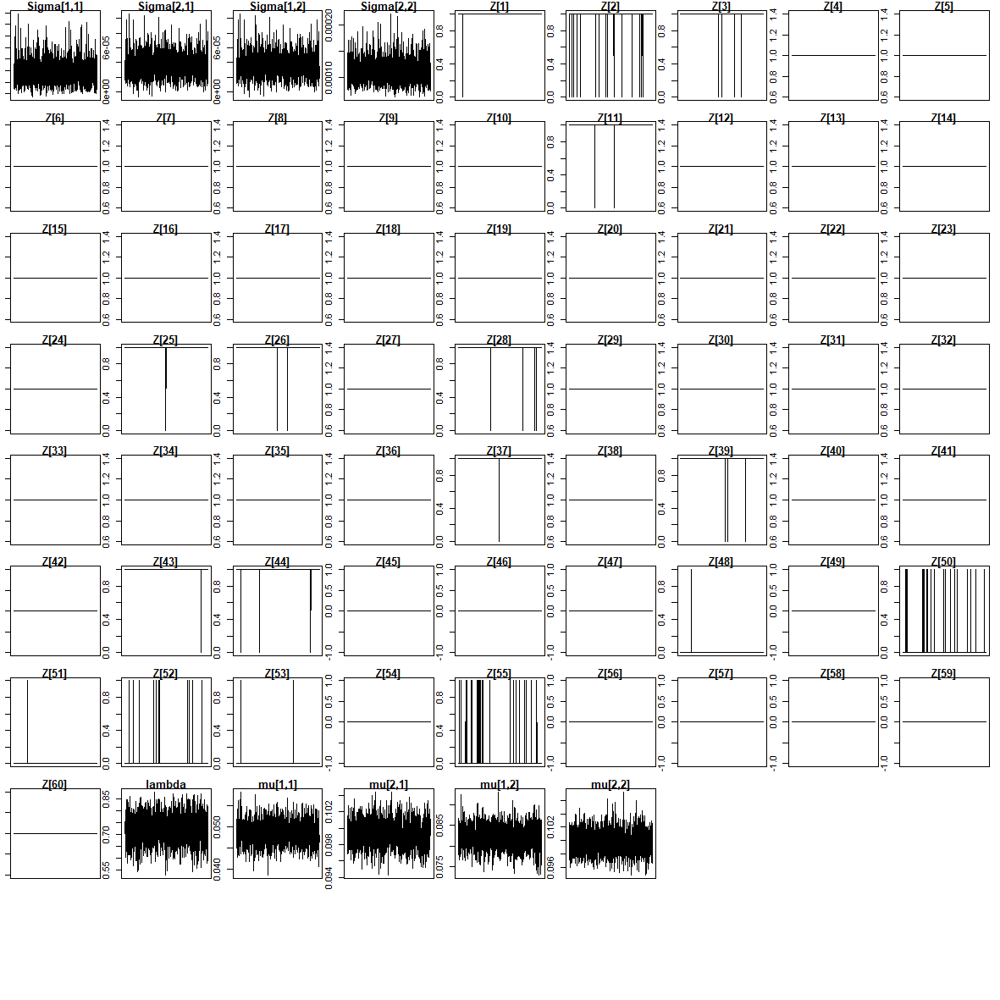

```{r, include=FALSE}
knitr::opts_chunk$set(echo = F,warning = F, message = F)
```

# Introduction
- The only valid method for detecting Alzheimer’s disease(AD) is the measurement of amyloid-$\beta$(A$\beta$) in cerebrospinal fluid(CSF). 
- Lower $A\beta_{42}/A\beta_{40}$ ratio, higher risk of developing AD dementia
- Extracting CSF from human’s brain is so expensive, a cost-effective blood test amyloid-$\beta$ biomarker is desirable. 

# Data

- The sample of CSF and plasma are from Longitudinal Innate Immunity and Aging(LIIA) cohort. 
- Older adults who are 60 years or older, In good general health, and have not been diagnosed with a memory disorder was recruited to LIIA study. 
- We only use baseline data and sample size is 130.

# Descriptive analysis

```{r}
library(knitr)
library(kableExtra)
library(table1)
t1kable(readRDS('../DataProcessed/table1.RDS'))%>% kable_styling(font_size = 6)
```

```{r, out.width='80%'}

```


# 

- A two component Gaussian mixture model was fitted to CSF A$\beta$ ratio to classify subjects as Amyloid negative and Amyloid positive. But we are not able to fit same model to plasma A$\beta$ ratio. 

- A Gaussian mixture model is a probabilistic model that assumes all the data points are generated from a mixture of a finite number of Gaussian distributions with unknown parameters

$$
f(y)=\sum_{k=1}^2 \pi_k \cdot N\left(
\begin{array}{l}
\mu_{k}
\end{array},
\sigma^2
\right) 
$$

# Joint distribution of CSF and plasma

- A bivariate Gaussian mixture model was used to fit the joint distribution of CSF and plasma, incorporating information from both sources while ensuring that CSF plays a dominant role in the classification.
$$
f\binom{y^{\text {csf }}}{y^{\text {plasma }}}=\sum_{k=1}^2 \pi_k \cdot N\left(
\begin{array}{l}
\mu_{k}
\end{array},
\Sigma
\right) 
$$

- Gibbs sampler was used to estimate the parameter of bivariate Gaussian mixture model
  - The Gibbs sampler is a Markov Chain Monte Carlo (MCMC) algorithm commonly used for sampling from complex, high-dimensional probability distributions
  - Parameters: $\mu_1^{csf}, \mu_1^{plasma},\mu_2^{csf}, \mu_2^{plasma}, \Sigma, \pi_1, z_{1-130}$

# Simulation 
We simulate 1,000 data for each of sample size 100, 200, 500 using parameter from real data and sensitivity, specificity, accuracy were calculated
across 1,000 datasets. The cutpoint for $z$ is 0.5. 
$$\mu_\text{1}=(0.05,0.08), \mu_\text{2}=(0.1,0.1), \Sigma=\left(\begin{array}{ll}0.0001082 & 0.0000375 \\0.0000375 & 0.0001030\end{array}\right)$$ $$\pi_1 = 0.3, \pi_2 = 0.7$$

# Findings

The estimated labels are very close to true labels. The standard deviation tend to decrease as sample size increased.

```{r}
readRDS('../DataProcessed/df class metric.RDS')%>%kable()%>% kable_styling(font_size = 7)
```

# Trace plots

```{r, out.width='80%'}

```


